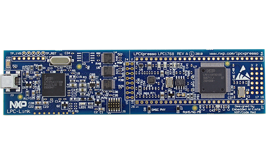

#   Teclado Matricial lpc1769 Ejemplo
Proyecto ejemplo para controlar un teclado matricial 4x4 con el micro controlador LPCXpresso lpc1769. El código es portable a distintos tamaños de teclado.

- IDE: [MCUXpresso IDE](https://www.nxp.com/design/software/development-software/mcuxpresso-software-and-tools-/mcuxpresso-integrated-development-environment-ide:MCUXpresso-IDE).
- Lenguaje: C.
- Microcontrolador: [LPCXpresso lpc1769 rev C](https://www.embeddedartists.com/products/lpc1769-lpcxpresso/).
- Teclado Membrana Matricial 4x4

---
## LPCXpresso LPC1769
 

## Teclado matricial 4x4

## Esquemático del proyecto

---
Autor: @ealegremendoza

E-mail: ealegremendoza@gmail.com
